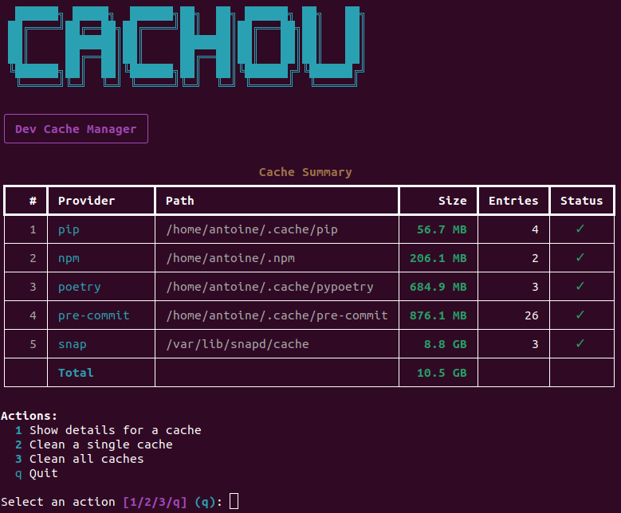

# cachou

Interactive CLI for managing development tool caches on Linux.

[



## Supported caches

| Provider   | Default cache path          |
|------------|-----------------------------|
| pip        | `~/.cache/pip`              |
| npm        | `~/.npm`                    |
| poetry     | `~/.cache/pypoetry`        |
| pre-commit | `~/.cache/pre-commit`       |

## Features

- **Show cache sizes** — see how much disk space each tool's cache uses
- **Inspect entries** — drill into individual cache components
- **Clean selectively** — remove a single cache or specific entries
- **Clean all** — wipe every detected cache in one step
- Stylized terminal UI powered by [Rich](https://github.com/Textualize/rich)

## Installation

```bash
pip install .
```

## Usage

```bash
cachou
```

This launches an interactive menu where you can:

1. **Show details** for any cache (sizes of sub-directories)
2. **Clean a single cache** (choose which entries to delete)
3. **Clean all caches** at once
4. **Quit**

## Development

```bash
pip install -e .
pip install pytest
python -m pytest tests/ -v
```

## License

MIT
